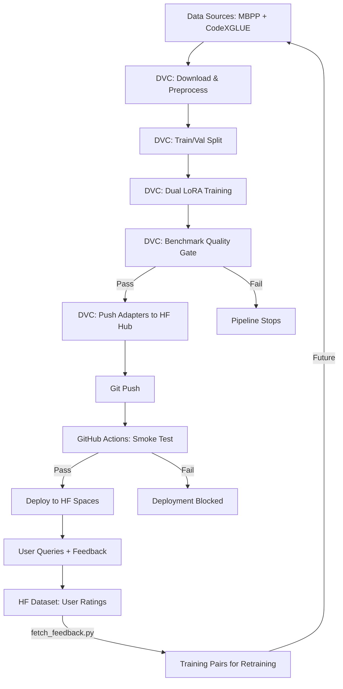

# BiLoRA System Design

## Architecture



## Design Decisions

### 1. Dual-Adapter LoRA (Why Not Full Fine-Tuning?)

Two tasks need different specializations but share the same base knowledge. Full fine-tuning would require storing two copies of a 3.8B model (~15GB each). Instead, we train two LoRA adapters (~15MB each) that target different model layers:

| Adapter | Target Layers | Why |
|---------|--------------|-----|
| Task 1 (Code Gen) | `qkv_proj`, `o_proj` (Attention) | Code generation benefits from improved attention over input descriptions |
| Task 2 (Docstring Gen) | `gate_up_proj`, `down_proj` (MLP) | Docstring generation benefits from improved feature transformation of code patterns |

At inference, both adapters are loaded once and switched via `model.set_adapter()` with zero overhead.

### 2. Two-Stage Quality Gate (Why Not Just CI?)

**Problem**: If we only validate in CI, bad adapters could already be pushed to HF Hub, and the live Space would serve them until CI catches up.

**Solution**: Validation happens twice at different depths:

| Stage | Where | What | Scope |
|-------|-------|------|-------|
| **Benchmark** (DVC) | Local (GPU) | Full eval: 20 samples, 3 models, Groq judge, regression check | Blocks `push-adapters` on failure |
| **Smoke Test** (CI) | GitHub Actions (CPU) | 1 sample/task, BiLoRA only, sanity check | Blocks deployment on failure |

The DVC benchmark is the real gate. CI is a lightweight safety net confirming the code runs on a clean environment.

### 3. Experiment Tracking via DVC Metrics (Why Not MLflow/W&B?)

For a portfolio project, adding MLflow or W&B would increase infrastructure complexity without adding much signal. DVC already tracks:

- **`training_metrics.json`**: Loss, duration, git hash, all hyperparams per run
- **`benchmarking/results.json`**: Full evaluation metrics across 3 models
- **`params.yaml`**: All hyperparameters in one place

This enables `dvc params diff`, `dvc metrics diff`, and `dvc experiments` out of the box. The tracking is built into the pipeline, not a separate system to maintain.

### 4. Auto-Promoting Baseline (Why Not Static?)

After a successful benchmark, `results.json` is copied to `baseline.json`. This means:

- Each successful run raises the quality bar for the next
- You can't accidentally regress without the pipeline catching it
- The baseline reflects the latest deployed model, not an arbitrary historical snapshot

### 5. Human-in-the-Loop Feedback (Why Collect It?)

The HF Spaces app collects thumbs up/down ratings per response. This creates a growing dataset of:

- **Positive examples**: User-validated prompt-response pairs for fine-tuning
- **Negative examples**: Failure cases for targeted improvement
- **Task distribution**: Which task users actually use more

`scripts/fetch_feedback.py` downloads this feedback and formats positive-rated responses into training pairs, closing the data flywheel.

## Data Flow

```
Training Data:
  MBPP (code gen) ──────────────────────┐
  CodeXGLUE (docstring gen) ────────────┤
                                        ▼
  Preprocess (tokenize, format) → Split (80/20) → Train
                                                    │
                                            ┌───────┴───────┐
                                            ▼               ▼
                                        task_1/         task_2/
                                        (attention)     (MLP)
                                            │               │
                                            └───────┬───────┘
                                                    ▼
                                            Benchmark (20 samples)
                                            BiLoRA vs Base vs Groq
                                                    │
                                              Pass? ──── No → Stop
                                                │
                                               Yes
                                                │
                                        Push to HF Hub + Update Baseline
                                                │
                                          Git Push → CI → Deploy

Production Feedback:
  User Query → Adapter Switch → Response → 👍/👎 → HF Dataset
                                                        │
                                              fetch_feedback.py
                                                        │
                                              training_pairs.json
                                              (positive examples)
```

## Inference Architecture

```
┌─────────────────────────────────────────────┐
│              HF Spaces (CPU)                │
│                                             │
│  Phi-3-mini-4k-instruct (float16, ~7.6GB)  │
│         │                                   │
│    ┌────┴────┐                              │
│    ▼         ▼                              │
│  task_1    task_2       ← set_adapter()     │
│  (15MB)    (15MB)         (zero-cost swap)  │
│                                             │
│  Prompt format (matches training exactly):  │
│    Task 1: "Generate code: {input}\nCode: " │
│    Task 2: "Generate docstring: {input}\n   │
│             Docstring: "                    │
└─────────────────────────────────────────────┘
```

## Key Files

| File | Purpose |
|------|---------|
| `params.yaml` | Single source of truth for all hyperparameters |
| `dvc.yaml` | Pipeline: 6 stages, 2 metric outputs |
| `src/training.py` | Trains both adapters, writes `training_metrics.json` |
| `src/push_adapters.py` | Uploads adapters + tokenizer to HF Hub |
| `benchmarking/evaluate.py` | Benchmarks BiLoRA vs Base Phi-3 vs Groq |
| `scripts/compare_metrics.py` | Regression check + auto-promote baseline |
| `scripts/fetch_feedback.py` | Downloads user feedback, formats for retraining |
| `hf_space/app.py` | Streamlit app with adapter switching + feedback collection |
| `.github/workflows/deploy.yml` | CI: smoke test + deploy to HF Spaces |
