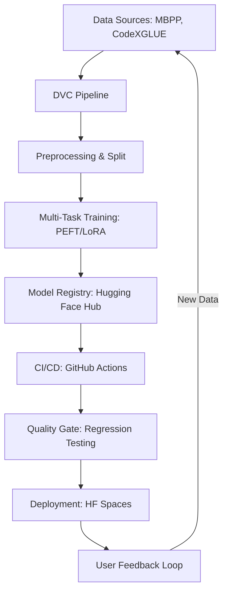

# BiLoRA MLOps System Design

This document outlines the architectural choices and pipeline design for the BiLoRA Code Assistant.

## 🏗️ System Architecture

## 🛠️ Key Components

### 1. Model Engineering (PEFT/BiLoRA)
Instead of fine-tuning the entire model twice, we use **Dual-Adapter LoRA**. This allows us to share 99% of the base model weights (`Phi-3 Mini`) while maintaining specialized knowledge for Code Generation and Docstring Generation in tiny, switchable adapter layers (~15MB each).

### 2. MLOps Pipeline (DVC)
We use **Data Version Control (DVC)** to ensure reproducibility. Every step from data download to model training is tracked. If the data changes, DVC knows exactly which parts of the pipeline need to be re-run.

### 3. Automated Quality Gates (CI/CD)
Our GitHub Actions pipeline doesn't just deploy; it **validates**.
- **Smoke Testing**: Runs the model on a small eval set to ensure no breaking code changes.
- **Regression Check**: Compares new metrics against a `baseline.json`. If accuracy or BLEU score drops significantly, the build fails.

### 4. Edge Optimization
The application is designed to run on **Free Tier CPU hardware**.
- **Quantization Ready**: The training uses 4-bit quantization.
- **Memory Management**: The deployment uses `float16` and `low_cpu_mem_usage` to fit within 16GB RAM.

### 5. Data Flywheel
The deployment includes a feedback mechanism. User interactions are logged, creating a potential "Gold Dataset" for future fine-tuning iterations, completing the ML lifecycle.
